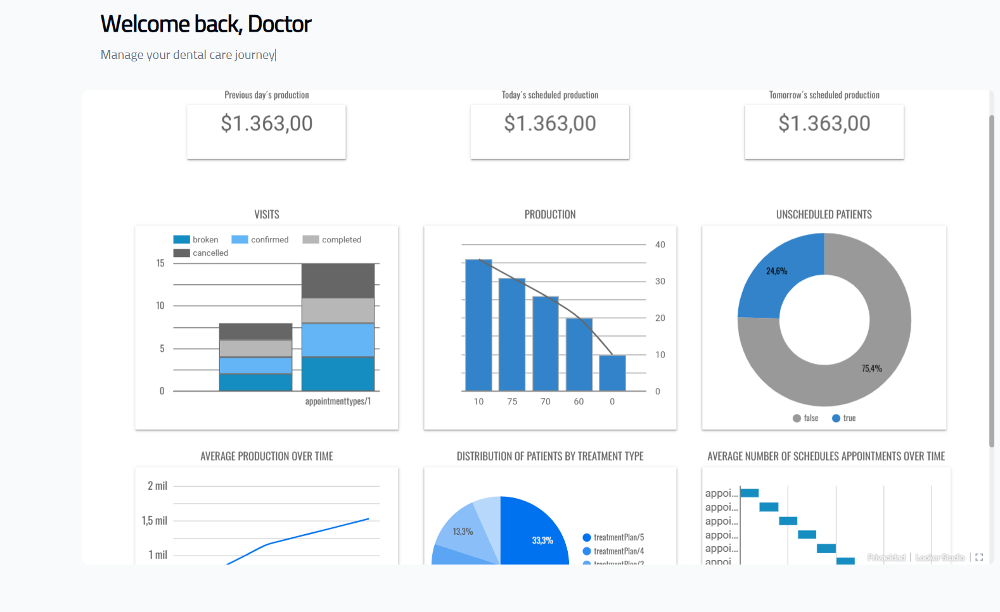

# Dental Rain Maker



## Description

**Dental Rain Maker** is a full-stack clinic management application designed to streamline dental clinic operations, allowing efficient appointment scheduling, patient management, and seamless communication.

This project integrates a range of modern technologies to ensure an optimized user experience, real-time notifications, and automated workflows. The application also includes an external API integration with **Kolla API**, working in parallel with the in-house system for efficient data management.

## Technologies Used

### Frontend:

- **React & Next.js**: For a fast and SEO-friendly frontend.
- **Redux**: State management across the application.
- **TailwindCSS**: For sleek and responsive UI styling.
- **NextAuth**: Secure authentication.
- **Toastify**: User-friendly notifications.

### Backend:

- **TypeScript & NestJS**: For a robust and scalable REST API.
- **Node.js & Express**: To handle API requests efficiently.
- **JWT (JSON Web Tokens)**: Secure authentication and authorization.
- **Scheduler**: Automates reminders and follow-ups.
- **Nodemailer & Brevo**: Email notifications and marketing campaigns.
- **Twilio**: SMS notifications.
- **Firebase**: Push notifications.
- **Make.com**: Workflow automation.
- **Google Forms**: Patient inquiries and feedback collection.
- **Swagger**: For API documentation.
- **Kolla API Integration**: Efficiently integrates with external Kolla API while working in parallel with the in-house system.

### Database

- **MongoDB**: for storing and managing movie data and user evaluations.

### Data Pipeline on Google Cloud Platform (GCP)

The project implements a data pipeline for **ETL (Extract, Transform, Load)** processes, integrating with **BigQuery** for advanced analytics.

#### **Pipeline Workflow**:

1. **Data Extraction**: Retrieves data from an external REST API.
2. **Processing with Cloud Functions**:
   - **Extraction Function**: Retrieves raw data from the API.
   - **Transformation Function**: Processes the extracted JSON data and structures it into a CSV format.
3. **Storage in Cloud Storage**:
   - **almacen-data Bucket**: Stores raw JSON files.
   - **clean-api-data Bucket**: Stores cleaned CSV files.
4. **Data Transformation**:
   - **Denormalization**: Extracts key data fields for structured storage.
   - **Column Cleanup**: Removes unnecessary columns.
   - **Format Conversion**: Transforms JSON data into CSV format.
5. **Loading into BigQuery**:
   - Data is loaded into predefined tables.
   - The data is automatically updated daily.
6. **Visualization with Looker**:
   - Generates interactive dashboards for data analysis.

### **Technologies Used for Data Pipeline:**

- **Google Cloud Platform (GCP)**: Cloud Functions, Cloud Storage, BigQuery.
- **Python**: Requests, Pandas for data transformation.
- **Looker**: For data visualization.
- **Automated Cloud Functions**: Ensures continuous updates in BigQuery.

## Deployment

- **Backend**: Deployed on [**Render**](https://dentalrainmaker.onrender.com/api).
- **Frontend**: Deployed on [**Vercel**](https://dental-rain-maker.vercel.app/).
- **Data Pipeline**: Hosted on **Google Cloud Platform (GCP)**.

## Dashboard Overview

The **Dental Rain Maker** dashboard provides insightful data visualizations:

- **Visits Breakdown**: Categorizes appointments as completed, confirmed, broken, or cancelled.
- **Production Metrics**: Tracks clinic revenue and productivity over time.
- **Unscheduled Patients**: Identifies patient scheduling trends.
- **Average Production Over Time**: Monitors revenue growth.
- **Patient Distribution by Treatment Type**: Pie chart representation of treatments.
- **Average Number of Scheduled Appointments Over Time**: Evaluates scheduling patterns.

## How to Run the Application

### **Clone the Repository**

```bash
git clone https://github.com/yourusername/dental-rain-maker.git
cd dental-rain-maker
```

### **Install Dependencies**

```bash
cd backend
npm install
cd ../frontend
npm install
```

### **Set Up Environment Variables**

Create a `.env` file in both the **backend** and **frontend** directories.

#### **Backend Variables**

```env
JWT_SECRET=Secret for signing JWT tokens.
MONGO_URI=MongoDB connection string.
FRONTEND_URL=Frontend application URL.
PORT=Port where the backend runs.
EMAIL_USER=Email used for sending notifications.
EMAIL_PASSWORD=Password for email authentication.
CLOUDINARY_CLOUD_NAME=Cloudinary cloud name for image storage.
CLOUDINARY_API_SECRET=Cloudinary API secret.
CLOUDINARY_API_KEY=Cloudinary API key.
FIREBASE_PROJECT_ID=Firebase project ID.
FIREBASE_PRIVATE_KEY=Firebase private key.
FIREBASE_CLIENT_EMAIL=Firebase service account email.
TWILIO_ACCOUNT_SID=Twilio account SID.
TWILIO_AUTH_TOKEN=Twilio authentication token.
TWILIO_MESSAGING_SERVICE_SID=Twilio messaging service SID.
UNIFY_DENTAL_KOLLA_API_URL=Kolla API URL for dental data integration.
UNIFY_DENTAL_KOLLA_BEARER_TOKEN=Bearer token for Kolla API.
UNIFY_DENTAL_KOLLA_CONNECTOR_ID=Kolla connector ID.
UNIFY_DENTAL_KOLLA_CONSUMER_ID=Kolla consumer ID.
BREVO_API_KEY=API key for Brevo email services.
BREVO_WEBHOOK_SECRET=Webhook secret for Brevo.
APPOINTMENTS_SURVEY_SECRET=Secret key for appointment surveys.
```

#### **Frontend Variables**

```env
NEXT_PUBLIC_API_URL=Backend API base URL.
NEXTAUTH_SECRET=Authentication secret key.
NEXT_PUBLIC_FIREBASE_API_KEY=Firebase API key.
NEXT_PUBLIC_FIREBASE_PROJECT_ID=Firebase project ID.
BREVO_CLIENT_KEY=Brevo client authentication key.
```

### **Run the Application**

```bash
cd frontend
npm run dev
cd backend
npm run start:dev
```

## Appointments Management

- **Create Appointments**: Users can book new patient appointments.
- **Modify Appointments**: Update or cancel appointments.
- **Automated Reminders**: Patients receive SMS, email, and push notifications for upcoming visits.

## Patient Records

- **Manage Patient Profiles**: Store and manage patient information.
- **Medical History**: Maintain patient visit history and treatment records.

## Notifications & Communications

- **Push Notifications (Firebase)**.
- **SMS Alerts (Twilio)**.
- **Email Campaigns (Brevo)**.
- **Automations (Make.com)**.

---

Thank you for checking out **Dental Rain Maker**! 🚀
