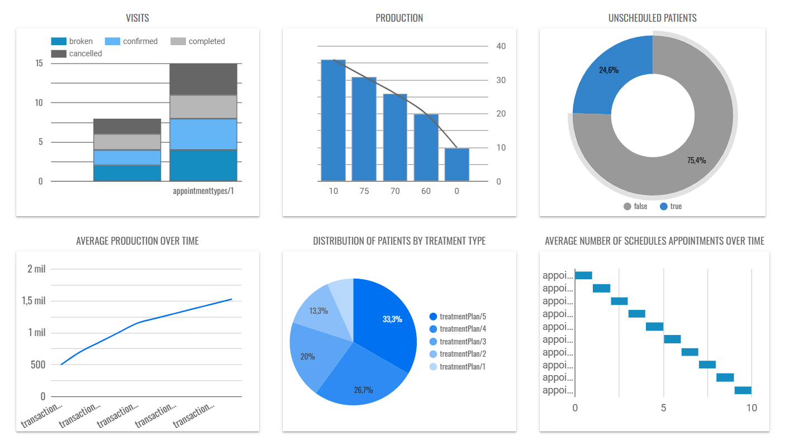

# Data Pipeline en Google Cloud Platform (GCP)

Este proyecto implementa un pipeline de datos en GCP para la extracción, transformación y carga (ETL) de datos desde una API externa hasta su almacenamiento y análisis en BigQuery.

Arquitectura del Pipeline

El pipeline sigue los siguientes pasos:

Extracción de Datos: Se obtienen datos desde una API REST.

Procesamiento con Cloud Functions: Se utilizan dos Cloud Functions para manejar la extracción y transformación de los datos.

Almacenamiento en Cloud Storage: Los datos en formato JSON se almacenan en el bucket almacen-data.

Transformación con Python y Pandas: Se procesan los archivos JSON para limpiar y estructurar los datos antes de su carga en BigQuery.

Almacenamiento de Datos Transformados: Los archivos transformados en formato CSV se almacenan en el bucket clean-api-data.

Carga en BigQuery: Los datos transformados se almacenan en tablas dentro de BigQuery, manteniendo la actualización de la información con una frecuencia diaria.

Visualización con Looker: Se genera un dashboard en Looker para el análisis de los datos extraídos.

Detalles Técnicos

1. Extracción de Datos

Los datos se obtienen desde una API REST externa.

2. Procesamiento con Cloud Functions

Se implementan dos Cloud Functions:

Función de Extracción: Obtiene los datos desde la API y los almacena en almacen-data.

Función de Transformación: Procesa los datos JSON, elimina columnas innecesarias y los convierte a CSV, almacenándolos en clean-api-data.

3. Almacenamiento en Cloud Storage

Bucket almacen-data: Contiene los archivos JSON sin procesar.

Bucket clean-api-data: Contiene los archivos CSV listos para ser cargados en BigQuery.

4. Transformación de Datos

Se realizan las siguientes transformaciones antes de la carga en BigQuery:

Desanidación: En cada endpoint, la columna corrspondiente a la informacion principal se desanida para normalizar la estructura.

Eliminación de columnas innecesarias: La columna next_page_token se elimina de todos los archivos.

Conversión de formato: Los archivos JSON se convierten a CSV y se almacenan en el bucket clean-api-data.

5. Carga en BigQuery

Los archivos CSV almacenados en clean-api-data se cargan en BigQuery en tablas predefinidas. Se mantiene la actualización automática para asegurar que los datos reflejen la información más reciente.

6. Visualización de Datos

Looker: Se utiliza para generar dashboards interactivos basados en los datos cargados en BigQuery.

Tecnologías Utilizadas

Google Cloud Platform (GCP): Cloud Functions, Cloud Storage, BigQuery

Python: Requests, Pandas

Looker: Visualización de datos

Despliegue y Automatización

El proceso de extracción y carga se ejecuta mediante Cloud Functions automatizadas, garantizando la actualización constante de los datos en BigQuery

